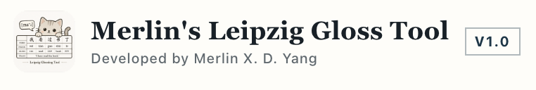
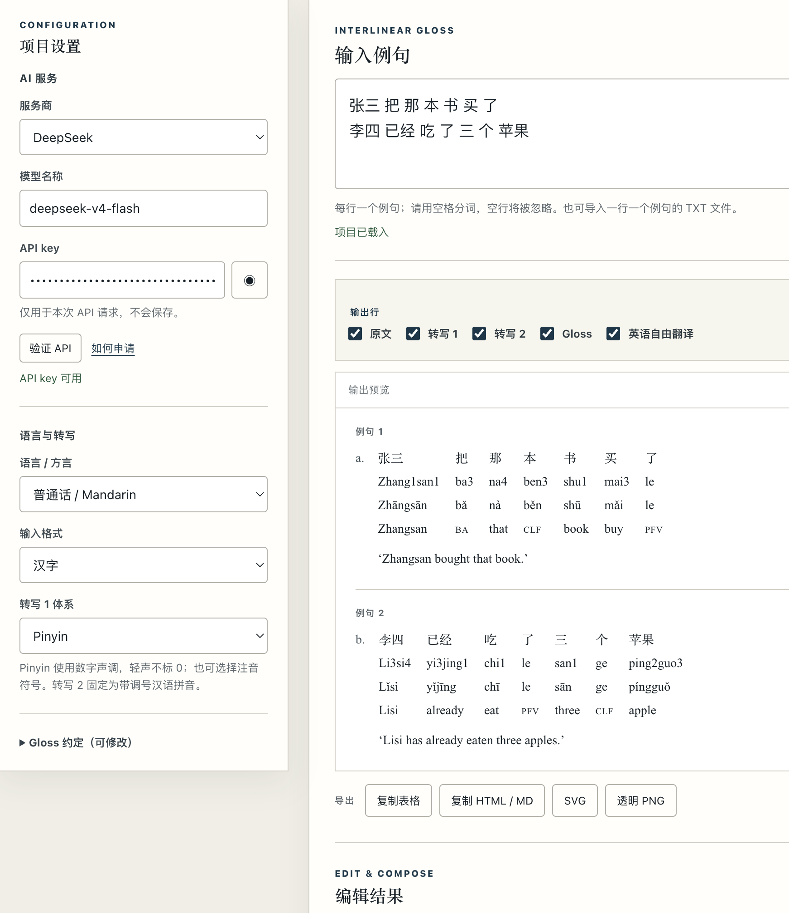
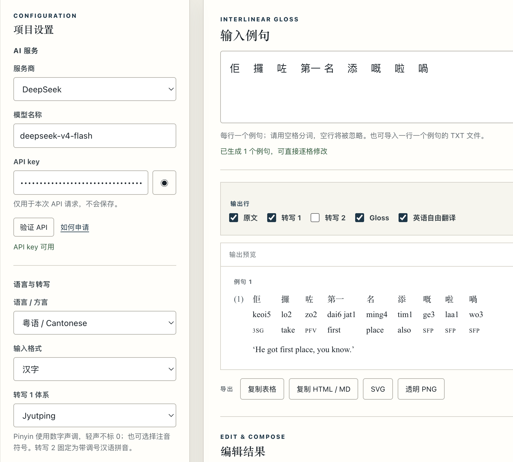
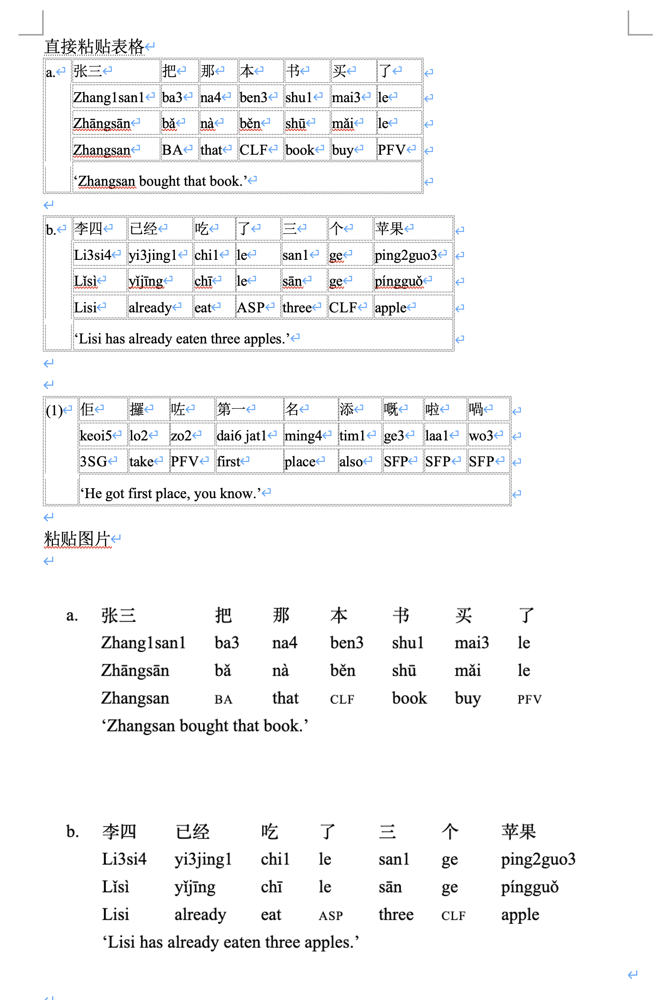

# Merlin's Leipzig Gloss Tool 1.0

[English](README.md) | **简体中文** | [正體中文](README.zh-TW.md)

一个轻量、可编辑的汉语莱比锡标注工具，支持普通话、粤语及其他汉语方言。

工具可通过 DeepSeek、OpenAI、Claude 或 OpenRouter 生成相互对齐的原文、转写、带调号拼音、Gloss 和英语自由翻译。所有结果均可逐格修改，并可复制到 Word，或导出为 SVG 和透明 PNG。



## 界面展示

### 普通话批量处理



### 粤语与粤拼



### 粘贴到 Word 与图片导出



## 主要功能

- 一行输入一个例句，支持一行一句的 TXT 批量导入。
- 支持普通话、粤语和自定义汉语方言。
- 转写 1 可选择拼音、粤拼、注音符号、IPA、耶鲁拼音或自定义体系。
- 转写 2 固定为带调号的标准汉语拼音；轻声不标 `0`，也不加调号。
- 每个词的原文、两层转写和 Gloss 均可编辑，英语翻译也可修改。
- 输出行可以任意组合，并可使用数字编号、`(a)` 编号、`a.` 编号或无编号。
- 每行均可单独设置字体、字号、粗体和斜体；全大写语法标记自动使用小型大写字母。
- 可复制无框表格到 Word，或导出 HTML / MD、SVG 和透明 PNG。
- 支持英文、简体中文和正体中文界面。

## 本地运行

无需安装第三方 Python 包。在终端进入项目目录后运行：

```bash
python3 app.py
```

浏览器会自动打开：

```text
http://127.0.0.1:8765/
```

按 `Control-C` 停止程序。

## LiteSpeed / PHP 部署

将完整目录上传到网站目录，同时保留 `api/`、`api.php` 和隐藏文件 `.htaccess`。生产环境由 PHP 处理 API 请求，不需要反向代理。

服务器要求：

- PHP 7.4 或更高版本
- `curl`、`json`、`openssl` 扩展
- HTTPS

## 使用流程

1. 选择 AI 服务商和模型，输入并验证 API key。
2. 选择语言、输入格式和转写体系。
3. 每行输入一个已经用空格分词的例句，或导入 TXT 文件。
4. 点击“生成 Gloss”。
5. 检查并逐格修改结果。
6. 选择输出行、编号方式和排版。
7. 复制表格、导出图片或保存项目。

API key 只会发送到同源后端用于当前请求，不会写入项目文件或浏览器存储。AI 生成的语言学分析仍应由研究者复核。

## 测试

```bash
python3 -m unittest -v
node --test test_batch.js test_typography.js test_interface_language.js
php -l api.php
```

更详细的中文说明参见 [使用说明.md](使用说明.md)。
